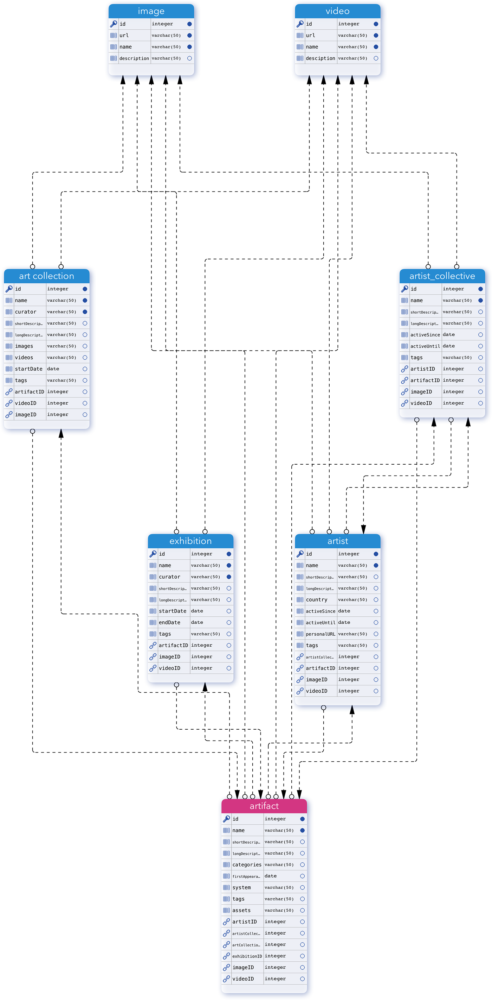

# ADAM - Archive of Digital Art & Media

## Beschreibung
In ADAM, dem Archive of Digital Art & Media, können Benutzer nach digitalen Kunstwerken suchen. Auf den Detailseiten finden sie eine Beschreibung des jeweiligen Kunstwerks, sowie Fotos/Screenshots und eingebettete Videos, und falls vorhanden ZIP-Dateien oder Diskimages mit den Originaldateien des Kunstwerks. Zudem finden sich Informationen über die Künstler, die Sammlung der das Kunstwerk angehört, und in welchen Ausstellungen es ausgestellt wurde.

ADAM besteht aus vier Teilen: Einem _API-Server_ mit einer Datenbank und Schnittstellen, um die Daten abzurufen, sowie einer Website mit einem _öffentlichen Bereich,_ in dem Besucher die Informationen über die digitalen Kunstwerke finden, und einem _Redaktionsbereich,_ in dem Redakteure neue Inhalte einpflegen und bearbeiten können, und Administratoren die Rechte verwalten können. Zu guter Letzt gibt es eine _Mobile-App,_ mit der man Einträge erstellen kann, Fotos und Videos hochladen kann.

## Die Struktur von ADAM

### 1. _API-Server_ auf Heroku unter Verwendung von MongoDB mit Schnittstellen für...

1. *Ansehen/holen* bestehender Einträge (GET)
2. *Erstellen* neuer Einträge (POST)
3. *Bearbeiten* bestehender Einträge (PUT)
4. Es gibt kein Delete, sondern nur ein PUT, um einen *Eintrag als gelöscht* zu markieren

### 2. _Öffentlicher Bereich im Web-Frontend_ und fünf Arten von Ansichten:

1. *Startseite* mit Karussell für Einträge, die von Admins als "besonders interessant" markierte wurden, sowie ein Grid mit acht der chronologisch zuletzt publizierten Einträge, allgemeine Informationen über die Plattform, Suchfunktion und eine Kategorienauswahl, die beide auf die Suchergebnisseite mit Filtermöglichkeiten führt.
    
2. *Suchergebnisseite* auf der die Suchergebnisse gefiltert werden können.
  
3. *Detailseite,* die für die Detailansicht eines Artefakts, eines Künstlers, einer Sammlung, und einer Ausstellung verwendet wird. Das Layout besteht aus einer Beschreibung, eines Fotobereichs, eines Bereichs für ein eingebettetes Video und darunter einer Liste an verwandten Einträgen:

    a. Bei einer _Künstler-Detailseite_ eine Liste der Arbeiten des Künstlers.

    b. Bei einer _Artefakt-Detailseite_ eine Liste der Künstler, die das Kunstwerk erschaffen haben

    c. Bei einer _Künstler-Kollektiv-Seite_ eine Liste der Künstler und der Artefakte.

    d. Bei einer _Detailseite über eine Sammlung_ eine Liste der Einträge der Artefakte, die Teil der Sammlung sind.

    e. Bei einer _Detailseite über eine Ausstellung_ eine Liste der ausgestellten Werke.

4. *Informationsseite,* in der allgemeine Informationen zu einem Thema stehen mit Text und Bildern, z.B. Artikel über Neuigkeiten, aber auch Nutzungsbedingungen und Datenschutzerklärung

5. Seite für den *Login bzw. die Registrierung* über den auth0.com Service

### Wireframes (unvollständig)

### 3. *Nicht-öffentlicher Bereich* im selben Web-Frontend mit...

1. _Admin-Bereich,_ um Benutzer zu verwalten (deaktivieren und reaktivieren), und um Einträge zu publizieren, auf "interessant" zu stellen (für das Karussel auf der Startseite), sowie um sie auf nicht-veröffentlicht zu setzen.
    
2. _Redaktionsansicht_ in der Benutzer mit Editor-Rechten bestehende Einträge bearbeiten können (Edit-Funktion wird nur nach dem Einloggen sichtbar) sowie neue Einträge erstellen können (Funktion für einen neuen Eintrag ist auch erst nach dem Einloggen sichtbar).

### 4. *Mobile App* (Optional)

1. Ansicht aller in der Mobile App vorbereiteter Einträge
    
2. Neuen Eintrag auf dem mobilen Gerät erstellen für Artefakt, Künstler, Künstlerkollektiv, Sammlung, Ausstellung.
    
3. Fotos und Videos auswählen
    
4. Einloggen
    
5. Eintrag mit Fotos und Video URLs hochladen

## Daten in der DB

- Artifact: name, short description, long description, category, system, first appearance, tags, images, videos, artist, artist collective, collection, exhibition

- Artist (grahics artist, programmer, musician, curator): name, country, short description, long description, specialization, active since, active until, tags, images, videos, artifacts, artist collective, exhibitions, art collections

- Art Collection: name, short description, long description, curator, start date, tags, images, videos, artifacts, artists, exhibitions

- Exhibition: name, short description, long description, systems, exhibition dates, tags, images, videos, artifacts, artists, artist collectives, art collections

- Artist Collective: name, description, tags, artists, artifacts, images, videos

### Datenmodell

## Benutzerrollen

1. *Admin:* Kann Einträge erstellen, bearbeiten und auf nicht-öffentlich stellen, sowie andere Benutzer deaktivieren, reaktivieren und ihre Rolle ändern

2. *Editor:* Kann Einträge erstellen und bearbeiten

## Technologien

*Webfrontend:* Angular, jQuery, Bootstrap

*API Server:* nodeJS, Express

*Mobile App:* nodeJS, Cordova

## Project Timeline

*Bis 16. Juli 2020*

- Konzept, Wireframes, Datenmodell und detaillierter Ablaufplan.

*Bis 24. Juli 2020*

- API-Server mit Musterdatensätzen. API-Aufrufe funktionieren und liefern Daten zurück

*Bis 31. Juli 2020*

- Öffentlicher Teil des Webfrontends fertiggestellt. Frontend zeigt die vier unterschiedlichen Ansichten, kann über die API Musterdaten abrufen und anzeigen.

*Bis 28. August 2020*

- Redaktionsbereich und Admin-Bereich (nicht-öffentlicher Bereich des Webfrontends) mit Login, Registrierung, neue Einträge erstellen, Einträge bearbeiten, Einträge deaktivieren und reaktivieren, Benutzer deaktivieren und reaktivieren

*Bis 4. September 2020*

- Mobile App mit (vorläufig) Einträge erstellen, Fotos aufnehmen und mit einem Eintrag assoziieren.

*Bis 11. September 2020*

- Mobile App mit Login und Upload.

*Bis 18. September 2020*

- Tests und Bugfixes, Zusammenspiel der Komponenten anpassen.

*Bis 25. September 2020*

- Tests und Bugfixes, Zusammenspiel der Komponenten anpassen.
