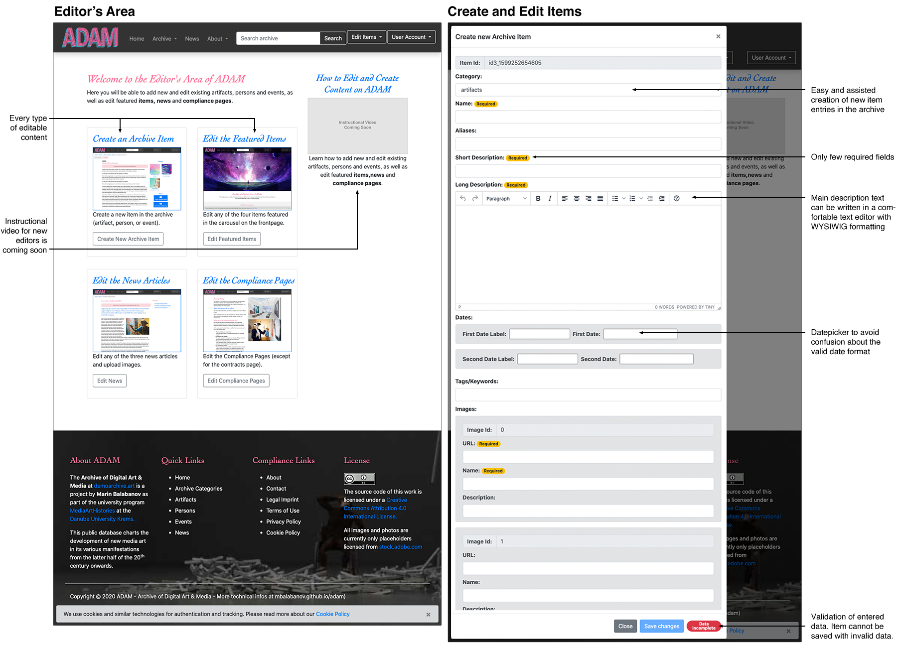
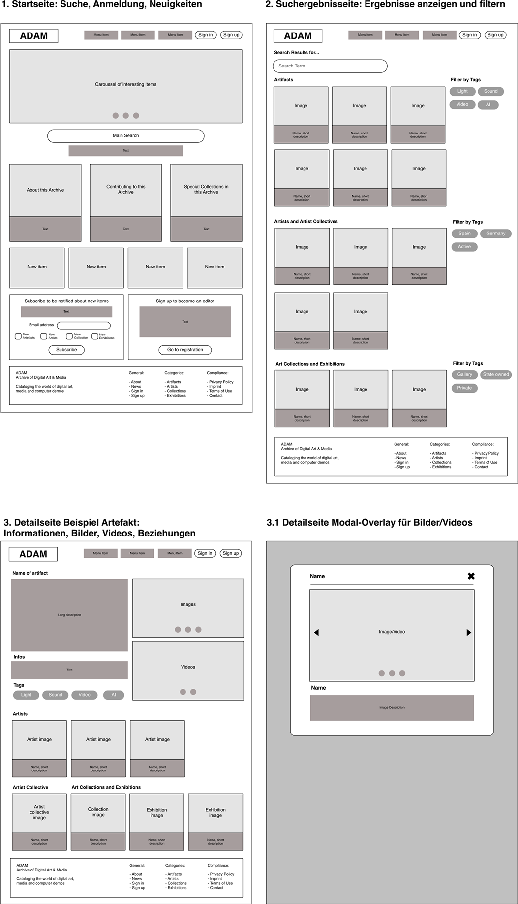

# Archive of Digital Art & Media


## Inhaltsverzeichnis
1. [Beschreibung](#1-beschreibung)
2. [Bestandteile und Installation](#2-bestandteile-und-installation)
3. [Detailansicht](#3-detailansicht)
4. [Die Struktur von ADAM](#4-die-struktur-von-adam)
5. [Konzept der Mobile App](#5-konzept-mobile-app)
6. [DB und API](#6-db-und-api)
7. [Benutzerrollen](#7-benutzerrollen)
8. [Technologien](#8-technologien)
9. [Aktualisierungen](#9-aktualisierungen)
10. [Projekt-Timeline](#10-projektplan)

## 1. Beschreibung
ADAM ist ein JavaScript/NodeJS/Angular/MongoDB/Heroku-Projekt von Marin Balabanov. In diesem Archive of Digital Art & Media auf [demoarchive.art](http://demoarchive.art/), können Benutzer nach digitalen Kunstwerken suchen. Auf den Detailseiten finden sie eine Beschreibung des jeweiligen Kunstwerks, sowie Fotos/Screenshots und eingebettete Videos, und falls vorhanden ZIP-Dateien oder Diskimages mit den Originaldateien des Kunstwerks. Zudem finden sich Informationen über die Künstler, und bei welchen Events ihre Werke ausgestellt wurden.

Dieses Projekt dient nur zu Übungszwecken und wurde vom "Archive of Digital Art" (ADA) der Donau Universität Krems inspiriert. Es dient als Übungsprojekt für die Anwendung zeitgemäßer Webtechnologien wie NodeJS, Angular, Ionic. MongoDB, Heroku und AWS S3.

**Die Bilder in diesem Projekt sind nur Platzhalter von [adobestock.com](http://adobestock.com). Sie sind zwar Teil dieses Repositories, sind aber nicht zur allgemeinen Verwendung freigegeben.**

ADAM besteht aus vier Teilen: Einem **API-Server** auf [adam-interface.herokuapp.com](https://adam-interface.herokuapp.com) mit Schnittstellen, um die Daten abzurufen, sowie einer Website mit einem **öffentlichen Bereich** auf [demoarchive.art](http://demoarchive.art/), in dem Besucher die Informationen über die digitalen Kunstwerke finden, und einem **Redaktionsbereich,** in dem Redakteure neue Inhalte einpflegen und bearbeiten können, und Administratoren die Rechte verwalten können. Zu guter Letzt gibt es eine **Mobile-App,** mit der man Einträge erstellen kann, Fotos und Videos hochladen kann.
---
[Zurück zum Inhaltsverzeichnis](#inhaltsverzeichnis)

## 2. Bestandteile und Installation
Dieses Projekt besteht aus den folgenden Repositories:
- **ADAM API Server** [github.com/mbalabanov/adam-api](https://github.com/mbalabanov/adam-api) (läuft Heroku auf auf [adam-interface.herokuapp.com](http://adam-interface.herokuapp.com))
- **ADAM Web Frontend** [github.com/mbalabanov/adam](https://github.com/mbalabanov/adam) (läuft auf Heroku auf [adam-frontend.herokuapp.com](http://adam-frontend.herokuapp.com))

### 2.1 Installation
Der ADAM API Server auf [github.com/mbalabanov/adam-api](https://github.com/mbalabanov/adam-api) läuft unter NodeJS/Express. So starten Sie den Server lokal (läuft auf Port 5003):
```
cd adam-api
npm install
npm start
```

Das ADAM Web Frontend auf [github.com/mbalabanov/adam](https://github.com/mbalabanov/adam) ist eine Angular Universal SSR App (Server Side Rendering). So starten Sie die App lokal  (läuft auf Port 4200):
```
cd adam
npm install
npm run dev:ssr
```
Bitte zu beachten: Wenn Sie für das Web Frontend den lokal laufenden API Server verwenden möchten, dann findet Sie die URL der API in der Datei `src/app/apirequestservice.service.ts`. Diese einfach auf `http://localhost:4200` ändern, dann läuft alles nur lokal.
---
[Zurück zum Inhaltsverzeichnis](#inhaltsverzeichnis)

## 3. Detailansicht

### Main Pages (Home, Search and Details)


### Editor's Area (Edit and Create)


### Information Pages (News and Compliance)


---
[Zurück zum Inhaltsverzeichnis](#inhaltsverzeichnis)

## 4. Die Struktur von ADAM

### 4.1. _API-Server_ auf Heroku unter Verwendung von MongoDB mit Schnittstellen für...

- Ansehen/holen bestehender Einträge (GET)
    - `/artifacts`
    - `/artifacts/:id`
    - `/persons`
    - `/persons/:id`
    - `/events`
    - `/events/:id`
    - `/news`
    - `/news/:id`
    - `/featured`
    - `/featured/:id`
    - `/compliance`
    - `/compliance/:id`

- Erstellen neuer Einträge (POST)

- Bearbeiten bestehender Einträge (PUT)

- Einträge auf ugelöscht setzen (DELETE)

Für mehr Details zur API siehe Dokumentation weiter unten.

### 4.2. _Öffentlicher Bereich im Web-Frontend_ und fünf Arten von Ansichten:


4.2.1. **Startseite** mit Karussell für Einträge, die von Admins als "besonders interessant" markierte wurden, sowie ein Grid mit acht der chronologisch zuletzt publizierten Einträge, allgemeine Informationen über die Plattform, Suchfunktion und eine Kategorienauswahl, die beide auf die Suchergebnisseite mit Filtermöglichkeiten führt.

4.2.2. **Suchergebnisseite** auf der die Suchergebnisse gefiltert werden können.

4.2.3. **Detailseite,** die für die Detailansicht eines Artefakts, eines Künstlers und eines Events verwendet wird. Das Layout besteht aus einer Beschreibung, eines Fotobereichs, eines Bereichs für ein eingebettetes Video und darunter einer Liste an verwandten Einträgen:
    a. Bei einer _Künstler-Detailseite_ eine Liste der Arbeiten des Künstlers.
    b. Bei einer _Artefakt-Detailseite_ eine Liste der Künstler, die das Kunstwerk erschaffen haben
    e. Bei einer _Detailseite über ein Event_ eine Liste der ausgestellten Werke.

4.2.4. **Informationsseite,** in der allgemeine Informationen zu einem Thema stehen mit Text und Bildern, z.B. Artikel über Neuigkeiten, aber auch Nutzungsbedingungen und Datenschutzerklärung

4.2.5. Seite für den **Login bzw. die Registrierung** über den auth0.com Service

4.2.6. **News-Seiten** mit dynamischem Inhalt. Diese beziehen ihren Inhalt über die API (/news und /news:id).

4.2.7. Diverse **Info-Seiten** über die allgemeine Bedienung des Kunstarchivs (z.B. "About", "Privacy Policy" und andere Complaince-Seiten). Diese beziehen ihren Inhalt ebenfalls über die API (/compliance).

4.2.8. Die **Kontaktseite** ist statisch sein und hat ein Kontaktformular.

### 4.3. Umgesetzte Struktur
Die folgende Struktur wurde auch tatächlich umgesetzt (hier mit einer Auflistung sämtlicher Components, die auf den Einzelseiten verwendet werden).

````
    +-+-+-+-+ +-+-+-+-+-+-+-+-+ +-+-+-+-+-+-+-+-+-+
    |A|D|A|M| |F|R|O|N|T|E|N|D| |S|T|R|U|C|T|U|R|E|
    +-+-+-+-+ +-+-+-+-+-+-+-+-+ +-+-+-+-+-+-+-+-+-+


   ┌──────────┐ PAGE STRUCTURE
   │   Home   │ 1. navbar.component with search and login (uses auth.service for
 ┌─┤   Page   │ login, sends search queries to search page).
 │ │          │ 2. carousel.component showing featured items (uses
 │ └──────────┘ apirequests.service to GET featured items).
 │              3. Static information on purpose of archive.
 │              4. archivecategories.component with search and links to the three
 │              categories (uses apirequests.service to GET category infos).
 │              5. Static information on how to contribute.
 │              6. newslist.component showing current news stories (uses
 │              apirequests.service to GET news items).
 │              7. footer.component.
 │              8. cookiewarning.component.
 │
 ├───────┬────────────────────────────────────────────────┐
 │       │                                                │
 │       ▼                                                ▼
 │ ┌──────────┐ PAGE STRUCTURE                       ┌──────────┐
 │ │ Archive  │ 1. navbar.component with search      │  Search  │
 │ │   Page   │ and login (uses auth.service         │ Results  │
 │ │          │ for login, sends search queries      │   Page   │
 │ └─────┬────┘ to search page).                     └────┬─────┘
 │       │      2. archivecategories.component            │
 │       │      (uses apirequests.service to              │ PAGE STRUCTURE
 │       │      GET category infos)                       │ 1. navbar.component with
 │       │      3. footer.component.                      │ search and login (uses
 │       │      4. cookiewarning.component.               │ auth.service for login,
 │       ▼                                                │ sends search queries to
 │      ┌──────────┐ PAGE STRUCTURE                       │ search page).
 │      │ Category │ 1. navbar.component with search      │ 2. searchall.component with
 │      │   List   │ and login (uses auth.service for     │ a searchfilter and
 │      │   page   │ login, sends search queries to       │ pagination for the results
 │      └─────┬────┘ search page).                        │ (uses apirequests.component
 │            │      2. categorylist.component (uses      │ to GET category items).
 │            │      apirequests.service to GET this      │ 3. footer.component.
 │            │      category's infos).                   │ 4. cookiewarning.component.
 │            │      3. footer.component.                 │
 │            │      4. cookiewarning.component.          │
 │            │    ┌──────────────────────────────────────┘
 │            │    │
 │            ▼    ▼
 │           ┌──────────┐ PAGE STRUCTURE
 │           │   Item   │ 1. navbar.component with search and login
 │           │ Details  │ (uses auth.service for login, sends
 │           │   Page   │ search queries to search page).
 │           └──────────┘ 2. itemdetails.component (uses
 │                        apirequests.service to GET item details
 │                        and auth.service to allow
 │                        editing/deleting the item).
 │                        3. footer.component.
 │                        4. cookiewarning.component.
 │
 ├───────┬────────────────────────────────────────────────┐
 │       │                                                │
 │       ▼                                                ▼
 │ ┌──────────┐ PAGE STRUCTURE                       ┌──────────┐ PAGE STRUCTURE
 │ │   Edit   │ 1. navbar.component with search and  │   User   │ 1. navbar.component with search
 │ │  Items   │ login (uses auth.service for login,  │ Profile  │ and login (uses auth.service
 │ │   Page   │ sends search queries to search page).│   Page   │ for login, sends search queries
 │ └──────────┘ 2. createarchiveitem.component (uses └──────────┘ to search page).
 │              apirequests.service to PUT new                    2. authprofile.component (uses
 │              items).                                           auth.service for user profile
 │              3. editcarouselfeatures.component                 data).
 │              (uses apirequests.service to GET and              3. footer.component.
 │              PUT featured items).                              4. cookiewarning.component.
 │              4. editnewspages.component (uses
 │              apirequests.service to GET and PUT
 │              news).
 │              5. editcompliancepages.component
 │              (uses apirequests.service to GET and
 │              PUT compliance pages).
 │              6. footer.component.
 │              7. cookiewarning.component.
 │
 └───────┬────────────────────────────────────────────────┐
         │                                                │
         ▼                                                ▼
   ┌──────────┐ PAGE STRUCTURE                       ┌──────────┐ PAGE STRUCTURE
   │News List │ 1. navbar.component with search      │Compliance│ 1. navbar.component with search and
   │   Page   │ and login (uses auth.service         │   Page   │ login (uses auth.service for login,
   │          │ for login, sends search queries      │          │ sends search queries to search page).
   └─────┬────┘ to search page).                     └────┬─────┘ 2. compliancearticle.component to
         │      2. newslist.component (uses               │       show the text of the current
         │      apirequests.service to GET news           │       compliance page based on URL slug
         │      items).                                   │       (uses apirequests.service to GET the
         │      3. footer.component.                      │       compliance text).
         │                                                │       3. footer.component.
         │                                                │       4. cookiewarning.component.
         ▼                                                ▼
        ┌──────────┐ PAGE STRUCTURE                      ┌──────────┐ PAGE STRUCTURE
        │   News   │ 1. navbar.component with search     │ Contact  │ 1. navbar.component with search
        │ Article  │ and login (uses auth.service        │   Page   │ and login (uses auth.service
        │   Page   │ for login, sends search queries     │          │ for login, sends search queries
        └──────────┘ to search page).                    └──────────┘ to search page).
                     2. newsarticle.component to                      2. Static information with
                     show the text of the current                     infos and contact form.
                     news item based on URL slug                      3. footer.component.
                     (uses apirequests.service to                     4. cookiewarning.component.
                     GET the news item).
                     3. footer.component.
                     4. cookiewarning.component.

````

### 4.4 Wireframes Besucheransicht
Untenstehend finden Sie die ursprünglichen Wireframes des öffentlichen Bereichs, den Benutzer besuchen können, ohne vorher einloggen zu müssen.



### 4.5. *Nicht-öffentlicher Bereich* im selben Web-Frontend mit...

4.5.1. **Redaktionsansicht** in der Benutzer mit Editor-Rechten bestehende Einträge bearbeiten können (Edit-Funktion wird nur nach dem Einloggen sichtbar) sowie neue Einträge erstellen können (Funktion für einen neuen Eintrag ist auch erst nach dem Einloggen sichtbar). Dieser Bereich befindet sich im Angular Webfrontend.
4.5.2. **Admin-Bereich,** um Benutzer zu verwalten (deaktivieren und reaktivieren). Dieser Bereich befindet sich in Auth0.com


### 4.6 Wireframes Redaktionsansicht
Untenstehend finden Sie die ursprünglichen Wireframes des Redaktionsbereichs, der nur für Benutzer zugänglich ist, die sich vorher eingeloggt haben.


---
[Zurück zum Inhaltsverzeichnis](#inhaltsverzeichnis)

### 5. Konzept der Mobile App

i. Ansicht aller in der Mobile App vorbereiteter Einträge
    
ii. Neuen Eintrag auf dem mobilen Gerät erstellen für Artefakt, Künstler, Künstlerkollektiv, Sammlung, Ausstellung.
    
iii. Fotos und Videos auswählen
    
iv. Einloggen
    
v. Eintrag mit Fotos und Video URLs hochladen


### 5.1 Mobile App Wireframes

---
[Zurück zum Inhaltsverzeichnis](#inhaltsverzeichnis)

## 6. DB und API

Als Datenbank wird MongoDB verwendet, das ein Dokument-basiertes Datenmodell hat mit der Möglichkeit Schema-los zu arbeiten.

- **Artifacts, Persons, Events:** id (String), category (String), name (String), aliases (Array), shortdescription (String), longdescription (String), dates (Array aus label, date), tags (Array), images (Array aus id, url, name, description), videos (Array aus id, url, name, description), websiteURLs (Array aus id, url, name), assets (Array aus id, url, name), artifacts (Array), persons (Array), events (Array)
- **News:** id (String), title (String), image (String), largeimage (String), shortdescription (String), articletext (String)
- **Featured:** id (String), image (String), title (String), description (String), link (String)
- **Compliance:** id (String), category (String), title (String), firstimage (String), secondimage (String), articletext (String)

### 6.1 Datenmodell


### 6.2 API-Dokumentation

Die API ist verfügbar unter [adam-interface.herokuapp.com](https://adam-interface.herokuapp.com)
*Wenn Sie die URL ohne Parameter aufrufen, wird eine Anleitung zurückgeliefert.*

#### GET (Root):
- `/` Anleitung

#### GET (mit all als Parameter):
- `/all` Alle Daten

#### GET (OHNE einer ID):
- `/artifacts` Alle artifacts (Kunstwerke).
- `/persons` Alle persons (Künstler, Kuratoren).
- `/events` Alle Events (Ausstellungen, Vernisagen, Performances).
- `/news` Die News-Artikel und ihre Inhalte.
- `/compliance` Die Texte der Compliance Seiten.
- `/featured` Die vier auf der Startseite ausgewiesenen Einträge.

#### GET (MIT einer ID):
- `/artifacts/id` Ein einzelnes Artifact (Kunstwerk).
- `/persons/id` Eine einzelne Person (Künstler, Kuratoren).
- `/events/id` Ein einzelner Event (Ausstellung, Vernisage, Performance).
- `/news/id` Ein einzelner News-Artikel und seine Inhalte.
- `/compliance/id` Der Inhalt einer einzelnen Compliance-Seite.
- `/featured/id` Einen der vier auf der Startseite ausgewiesenen Beiträge.

#### DELETE (MIT einer ID):
- `/artifacts/id` Ein einzelnes Artifact (Kunstwerk) löschen.
- `/persons/id` Eine einzelne Person (Künstler, Kuratoren) löschen.
- `/events/id` Einen einzelnen Event (Ausstellung, Vernisage, Performance) löschen.
- `/compliance/id` Eine einzelne Compliance-Seite löschen.
- `/news/id` Einen einzelnen News-Artikel löschen.
- `/featured/id` Einen der vier auf der Startseite ausgewiesenen Beiträge löschen.

Bitte zu beachten, dass Compliance-Seiten und Featured-Beiträge nur mit äußerster Vorsicht gelöscht werden sollten. Im Idealfall würde man nur die bestehenden Beiträge ändern und weder neue hinzufügen, noch bestehende löschen.

#### PUT (MIT einer ID):
- `/artifacts/id` Ein einzelnes Artifact (Kunstwerk) bearbeiten.
- `/persons/id` Eine einzelne Person (Künstler, Kuratoren) bearbeiten.
- `/events/id` Einen einzelnen Event (Ausstellung, Vernisage, Performance) bearbeiten.
- `/news/id` Einen einzelnen News-Artikel bearbeiten.
- `/compliance/id` Eine einzelne Compliance-Seite bearbeiten.
- `/featured/id` Einen einzelnen Featured-Item bearbeiten.

#### POST (MIT der Parameter new):
- `/artifacts/new` Ein neues Artifact (Kunstwerk) erstellen.
- `/persons/new` Eine neue Person (Künstler, Kuratoren) erstellen.
- `/events/new` Einen neuen Event (Ausstellung, Vernisage, Performance) erstellen.
- `/compliance/new` Eine neue Compliance-Seite erstellen.
- `/news/new` Einen neuen News-Artikel erstellen.

_Bitte beachten Sie, dass kein neuer auf der Startseite ausgewiesenen Beitrag (featured item) erstellt werden sollte. Auf der Startseite sollten möglichst nur vier Beiträge ausgewiesen sein. Außerdem sollte man nur in äußersten Ausnahmen eine neue Compliance-Seite hinzufügen. Danach müsste auch die Navigation ergänzt werden, die Menüpunkte in der NavBar sind statisch._

### 6.3 JSON-Beispiel (Artifact)

```
{
    "id": "a0",
    "category": "artifacts",
    "name": "Varoph Lorem Ipsum",
    "aliases": ["Lemon Dance", "Folklore Elephant"],
    "shortdescription": "Varoph Lorem ipsum dolor sit amet, test consetetur sadipscing elitr, sed diam nonumy eirmod tempor invidunt ut labore et dolore magna aliquyam erat, sed diam voluptua.",
    "longdescription": "<p>Varoph Lorem ipsum dolor sit amet, test consetetur sadipscing elitr, sed diam nonumy eirmod tempor invidunt ut labore et dolore magna aliquyam erat, sed diam voluptua.</p><p>At vero eos et accusam et justo duo dolores et ea rebum.</p><p>Lorem ipsum dolor sit amet, consectetur adipiscing elit. Fusce dapibus, tellus ac cursus commodo, tortor mauris condimentum nibh, ut fermentum massa justo sit amet risus. Sed posuere consectetur est at lobortis. Vestibulum id ligula porta felis euismod semper.</p>",
    "dates": [{"label": "First released on ", "date": "1987-03-01"}],
    "tags": [
        "Pharetra Tortor",
        "Commodo",
        "Generative",
        "Gustatory",
        "Hypermediacy"
    ],
    "images": [
        {
            "id": "0",
            "url": "assets/img/artifacts/artifacts1.jpg",
            "name": "Venenatis Cursus Nullam",
            "description": "Cras justo odio, dapibus ac facilisis in, egestas eget quam."
        },
        {
            "id": "1",
            "url": "assets/img/collections/collections1.jpg",
            "name": "Sed diam nonumy eirmod tempor",
            "description": "Labore et dolore magna aliquyam erat, sed diam voluptua."
        },
        {
            "id": "2",
            "url": "assets/img/portraits/portrait07.jpg",
            "name": "Cras Ligula Consectetur Tortor",
            "description": "Vivamus sagittis lacus vel augue laoreet rutrum faucibus dolor auctor. Curabitur blandit tempus porttitor."
        },
        {
            "id": "3",
            "url": "assets/img/additional/additional-01.jpg",
            "name": "Sollicitudin Inceptos Parturient",
            "description": "Nulla vitae elit libero, a pharetra augue."
        }
    ],
    "videos": [
        {
            "id": "0",
            "url": "https://youtu.be/sUx-f686Wg4",
            "name": "Consetetur sadipscing Sit Lorem",
            "description": "Consetetur sadipscing elitr, sed diam nonumy eirmod tempor."
        },
        {
            "id": "1",
            "url": "https://www.youtube.com/watch?v=w54uNAuqE1Y",
            "name": "Consetetur sadipscing",
            "description": "Consetetur sadipscing elitr, sed diam nonumy eirmod tempor."
        },
        {
            "id": "2",
            "url": "https://youtu.be/oarR61SeY8E",
            "name": "Elit Justo Pellentesque",
            "description": "Cras mattis consectetur purus sit amet fermentum."
        }
    ],
    "websiteURLs": [
        {
            "id": "0",
            "name": "Medien Art Net",
            "url": "http://www.medienkunstnetz.de/mediaartnet/"
        }
    ],
    "assets": [
        {
            "id": "0",
            "name": "Native executable",
            "url": "http://pacidemo.planet-d.net/archives/POV003.ZIP"
        }
    ],
    "artifacts": [],
    "persons": [
        "p0",
        "p1",
        "p2"
    ],
    "events": [
        "e1",
        "e2"
    ]
}
```

## 7. Benutzerrollen

1. **Editor:** Kann Einträge erstellen und bearbeiten
2. **Admin:** Kann Benutzer deaktivieren, reaktivieren und ihre Rolle ändern
---
[Zurück zum Inhaltsverzeichnis](#inhaltsverzeichnis)

## 8. Technologien

**Webfrontend:**
- Angular Universal (Funktionalität)
- Bootstrap (Design)
- jQuery (Allgemein)

**Registrierung und Usermanagement:**
- auth0.com (Login, Registrierung, Benutzerprofil)

**API Server:**
- Node JS
- Express
- MongoDB
- Heroku (Hosting)
- Amazon S3 (Bilder Hosting)

**Mobile App:**
- Node JS
- Angular
- Cordova oder NativeScript
---
[Zurück zum Inhaltsverzeichnis](#inhaltsverzeichnis)

## 9. Aktualisierungen
- **22. August 2020:** App komplett aufgeräumt und auf Angular Unversal konvertiert ( [demoarchive.art](https://demoarchive.art) leitet jetzt auf [adam-frontend.herokuapp.com](https://adam-frontend.herokuapp.com) )
- **20. August 2020:** API vom Frontend getrennt. Hat nun ein eigenes Repository auf [github.com/mbalabanov/adam-api](https://github.com/mbalabanov/adam-api)
- **13. August 2020:** Auth0-Integration abgeschlossen (vorläufig mit Anmeldung über Email und Google-Account).
- **12. August 2020:** Öffentliches Web-Frontend ist soweit fertig und alle Consolen-Fehler sind beseitigt. Die gesamte Suchfunktion läuft über Angular Search-Filter (und nicht über LunrJS). Die ersten Schritte für das Redaktions-Backend sind mit der vorläufig unvollständigen Integration von auth0.com gemacht.
- **7. August 2020:** Öffentliches Web-Frontend bezieht nun sämtliche Daten von der API (allerdings treten noch Fehler in der Console auf und einige Routes funktionieren noch nicht richtig).
- **6. August 2020:** Erweitertes Angular-Frontend, konsolodiertes Datenmodell und angepasste API.
- **31. Juli 2020:** Erste Fassung des Web-Frontends auf [demoarchive.art](http://demoarchive.art/) fertiggestellt (allerdings noch ohne API-Anbindung).
- **30. Juli 2020:** Erste Fassung der API auf [adam-interface.herokuapp.com](https://adam-interface.herokuapp.com) fertiggestellt.
- **24. Juli 2020:** Erster unvollständiger Versuch, mit der API und dem Webfrontend (noch ohne Angular) zu Versuchszwecken.
- **15. Juli 2020:** Mobile App Wireframes hinzugefügt, API aktualisiert, GET-API-Aufrufe bereit, Domain demoarchive.art registriert.
- **13. Juli 2020:** Datenmodelldiagramm, Sitemap und Wireframes aktualisiert
- **12. Juli 2020:** Testdaten als JSON-Datei
- **8. Juli 2020:** Erstfassung der Dokumentation 
---
[Zurück zum Inhaltsverzeichnis](#inhaltsverzeichnis)

## 10. Projektplan

- **Bis 16. Juli 2020:** Konzept, Wireframes, Datenmodell, detaillierter Ablaufplan und Projektplan. API-Server mit Musterdatensätzen auf Heroku. API-Aufrufe funktionieren und liefern Daten zurück.

- **Bis 24. Juli 2020:** Funktionierendes und implementiertes Design des Webfrontends in Angular.

- **Bis 31. Juli 2020:** Öffentlicher Teil des Web-Frontends fertiggestellt. Frontend zeigt die vier unterschiedlichen Ansichten, kann über die API Musterdaten abrufen und anzeigen.

- **Bis 28. August 2020:** Redaktionsbereich und Admin-Bereich (nicht-öffentlicher Bereich des Webfrontends) mit Login, Registrierung, neue Einträge erstellen, Einträge bearbeiten, Einträge deaktivieren und reaktivieren, Benutzer deaktivieren und reaktivieren.

- **Bis 4. September 2020:** Redaktionsbereich und Admin-Bereich.

- **Bis 11. September 2020:** Mobile App mit (vorläufig) Einträge erstellen, Fotos aufnehmen und mit einem Eintrag assoziieren.

- **Bis 18. September 2020:** Mobile App mit Login und Upload.

- **Bis 25. September 2020:** Mobile App mit Login und Upload.

---
[Zurück zum Inhaltsverzeichnis](#inhaltsverzeichnis)