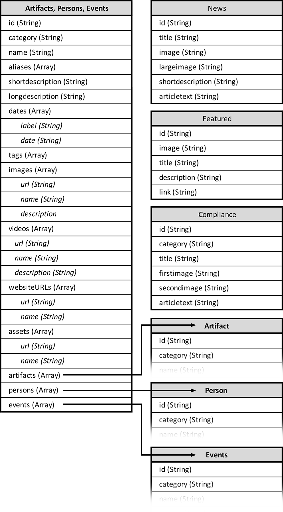

# Archive of Digital Art & Media


## Beschreibung
ADAM ist ein JavaScript/NodeJS/Angular/MongoDB/Heroku-Projekt von Marin Balabanov. In diesem Archive of Digital Art & Media auf [demoarchive.art](http://demoarchive.art/), können Benutzer nach digitalen Kunstwerken suchen. Auf den Detailseiten finden sie eine Beschreibung des jeweiligen Kunstwerks, sowie Fotos/Screenshots und eingebettete Videos, und falls vorhanden ZIP-Dateien oder Diskimages mit den Originaldateien des Kunstwerks. Zudem finden sich Informationen über die Künstler, und bei welchen Events ihre Werke ausgestellt wurden.

Dieses Projekt dient nur zu Übungszwecken und wurde vom "Archive of Digital Art" (ADA) der Donau Universität Krems inspiriert. Es dient als Übungsprojekt für die Anwendung zeitgemäßer Webtechnologien wie NodeJS, Angular, Ionic. MongoDB, Heroku und AWS S3.

ADAM besteht aus vier Teilen: Einem _API-Server_ auf [adam-interface.herokuapp.com](https://adam-interface.herokuapp.com) mit einer Datenbank und Schnittstellen, um die Daten abzurufen, sowie einer Website mit einem _öffentlichen Bereich_ auf [demoarchive.art](http://demoarchive.art/), in dem Besucher die Informationen über die digitalen Kunstwerke finden, und einem _Redaktionsbereich,_ in dem Redakteure neue Inhalte einpflegen und bearbeiten können, und Administratoren die Rechte verwalten können. Zu guter Letzt gibt es eine _Mobile-App,_ mit der man Einträge erstellen kann, Fotos und Videos hochladen kann.

## Aktualisierungen
- *22. August 2020:* App komplett aufgeräumt und auf Angular Unversal konvertiert ( [https://demoarchive.art](https://demoarchive.art) leitet jetzt auf [https://adam-frontend.herokuapp.com](https://adam-frontend.herokuapp.com) )
- *20. August 2020:* API vom Frontend getrennt. Hat nun ein eigenes Repository auf [https://github.com/mbalabanov/adam-api](https://github.com/mbalabanov/adam-api)
- *13. August 2020:* Auth0-Integration abgeschlossen (vorläufig mit Anmeldung über Email und Google-Account).
- *12. August 2020:* Öffentliches Web-Frontend ist soweit fertig und alle Consolen-Fehler sind beseitigt. Die gesamte Suchfunktion läuft über Angular Search-Filter (und nicht über LunrJS). Die ersten Schritte für das Redaktions-Backend sind mit der vorläufig unvollständigen Integration von auth0.com gemacht.
- *7. August 2020:* Öffentliches Web-Frontend bezieht nun sämtliche Daten von der API (allerdings treten noch Fehler in der Console auf und einige Routes funktionieren noch nicht richtig).
- *6. August 2020:* Erweitertes Angular-Frontend, konsolodiertes Datenmodell und angepasste API.
- *31. Juli 2020:* Erste Fassung des Web-Frontends auf [demoarchive.art](http://demoarchive.art/) fertiggestellt (allerdings noch ohne API-Anbindung).
- *30. Juli 2020:* Erste Fassung der API auf [adam-interface.herokuapp.com](https://adam-interface.herokuapp.com) fertiggestellt.
- *24. Juli 2020:* Erster unvollständiger Versuch, mit der API und dem Webfrontend (noch ohne Angular) zu Versuchszwecken.
- *15. Juli 2020:* Mobile App Wireframes hinzugefügt, API aktualisiert, GET-API-Aufrufe bereit, Domain demoarchive.art registriert.
- *13. Juli 2020:* Datenmodelldiagramm, Sitemap und Wireframes aktualisiert
- *12. Juli 2020:* Testdaten als JSON-Datei
- *8. Juli 2020:* Erstfassung der Dokumentation 

---

## Die Struktur von ADAM

### 1. _API-Server_ auf Heroku unter Verwendung von MongoDB mit Schnittstellen für...

- Ansehen/holen bestehender Einträge (GET)
    - /artifacts
    - /artifacts/:id
    - /persons
    - /persons/:id
    - /events
    - /events/:id
    - /news
    - /news/:id
    - /featured
    - /featured/:id
    - /compliance
    - /compliance/:id

- Erstellen neuer Einträge (POST)

- Bearbeiten bestehender Einträge (PUT)

- Einträge auf ugelöscht setzen (DELETE)

Für mehr Details zur API siehe Dokumentation weiter unten.

### 2. _Öffentlicher Bereich im Web-Frontend_ und fünf Arten von Ansichten:


1. *Startseite* mit Karussell für Einträge, die von Admins als "besonders interessant" markierte wurden, sowie ein Grid mit acht der chronologisch zuletzt publizierten Einträge, allgemeine Informationen über die Plattform, Suchfunktion und eine Kategorienauswahl, die beide auf die Suchergebnisseite mit Filtermöglichkeiten führt.
    
2. *Suchergebnisseite* auf der die Suchergebnisse gefiltert werden können.
  
3. *Detailseite,* die für die Detailansicht eines Artefakts, eines Künstlers und eines Events verwendet wird. Das Layout besteht aus einer Beschreibung, eines Fotobereichs, eines Bereichs für ein eingebettetes Video und darunter einer Liste an verwandten Einträgen:
    a. Bei einer _Künstler-Detailseite_ eine Liste der Arbeiten des Künstlers.
    b. Bei einer _Artefakt-Detailseite_ eine Liste der Künstler, die das Kunstwerk erschaffen haben
    e. Bei einer _Detailseite über ein Event_ eine Liste der ausgestellten Werke.

4. *Informationsseite,* in der allgemeine Informationen zu einem Thema stehen mit Text und Bildern, z.B. Artikel über Neuigkeiten, aber auch Nutzungsbedingungen und Datenschutzerklärung

5. Seite für den *Login bzw. die Registrierung* über den auth0.com Service

6. News-Seiten mit dynamischem Inhalt. Diese beziehen ihren Inhalt über die API (/news und /news:id).

7. Diverse dynamische Seiten über die allgemeine Bedienung des Kunstarchivs (z.B. "About", "Privacy Policy" und andere Complaince-Seiten). Diese beziehen ihren Inhalt ebenfalls über die API (/compliance).

8. Die Kontaktseite ist statisch sein und hat ein Kontaktformular.

### Wireframes Besucheransicht


### 3. *Nicht-öffentlicher Bereich* im selben Web-Frontend mit...

1. _Redaktionsansicht_ in der Benutzer mit Editor-Rechten bestehende Einträge bearbeiten können (Edit-Funktion wird nur nach dem Einloggen sichtbar) sowie neue Einträge erstellen können (Funktion für einen neuen Eintrag ist auch erst nach dem Einloggen sichtbar). Dieser Bereich befindet sich im Angular Webfrontend.
2. _Admin-Bereich,_ um Benutzer zu verwalten (deaktivieren und reaktivieren). Dieser Bereich befindet sich in Auth0.com


### Wireframes Redaktionsansicht


### 4. *Mobile App* (Optional)

1. Ansicht aller in der Mobile App vorbereiteter Einträge
    
2. Neuen Eintrag auf dem mobilen Gerät erstellen für Artefakt, Künstler, Künstlerkollektiv, Sammlung, Ausstellung.
    
3. Fotos und Videos auswählen
    
4. Einloggen
    
5. Eintrag mit Fotos und Video URLs hochladen

### Mobile App Wireframes


## Daten in der DB

Als Datenbank wird MongoDB verwendet, das ein Dokument-basiertes Datenmodell hat mit der Möglichkeit Schema-los zu arbeiten.

- *Artifacts, Persons, Events:* id (String), category (String), name (String), aliases (Array), shortdescription (String), longdescription (String), dates (Array aus label, date), tags (Array), images (Array aus id, url, name, description), videos (Array aus id, url, name, description), websiteURLs (Array aus id, url, name), assets (Array aus id, url, name), artifacts (Array), persons (Array), events (Array)
- *News:* id (String), title (String), image (String), largeimage (String), shortdescription (String), articletext (String)
- *Featured:* id (String), image (String), title (String), description (String), link (String)
- *Compliance:* id (String), category (String), title (String), firstimage (String), secondimage (String), articletext (String)

### Datenmodell



### JSON-Beispiel (Artifact)

```
{
    "id": "a0",
    "category": "artifacts",
    "name": "Varoph Lorem Ipsum",
    "aliases": ["Lemon Dance", "Folklore Elephant"],
    "shortdescription": "Varoph Lorem ipsum dolor sit amet, test consetetur sadipscing elitr, sed diam nonumy eirmod tempor invidunt ut labore et dolore magna aliquyam erat, sed diam voluptua.",
    "longdescription": "<p>Varoph Lorem ipsum dolor sit amet, test consetetur sadipscing elitr, sed diam nonumy eirmod tempor invidunt ut labore et dolore magna aliquyam erat, sed diam voluptua.</p><p>At vero eos et accusam et justo duo dolores et ea rebum.</p><p>Lorem ipsum dolor sit amet, consectetur adipiscing elit. Fusce dapibus, tellus ac cursus commodo, tortor mauris condimentum nibh, ut fermentum massa justo sit amet risus. Sed posuere consectetur est at lobortis. Vestibulum id ligula porta felis euismod semper.</p>",
    "dates": [{"label": "First released on ", "date": "1987-03-01"}],
    "tags": [
        "Pharetra Tortor",
        "Commodo",
        "Generative",
        "Gustatory",
        "Hypermediacy"
    ],
    "images": [
        {
            "id": "0",
            "url": "assets/img/artifacts/artifacts1.jpg",
            "name": "Venenatis Cursus Nullam",
            "description": "Cras justo odio, dapibus ac facilisis in, egestas eget quam."
        },
        {
            "id": "1",
            "url": "assets/img/collections/collections1.jpg",
            "name": "Sed diam nonumy eirmod tempor",
            "description": "Labore et dolore magna aliquyam erat, sed diam voluptua."
        },
        {
            "id": "2",
            "url": "assets/img/portraits/portrait07.jpg",
            "name": "Cras Ligula Consectetur Tortor",
            "description": "Vivamus sagittis lacus vel augue laoreet rutrum faucibus dolor auctor. Curabitur blandit tempus porttitor."
        },
        {
            "id": "3",
            "url": "assets/img/additional/additional-01.jpg",
            "name": "Sollicitudin Inceptos Parturient",
            "description": "Nulla vitae elit libero, a pharetra augue."
        }
    ],
    "videos": [
        {
            "id": "0",
            "url": "https://youtu.be/sUx-f686Wg4",
            "name": "Consetetur sadipscing Sit Lorem",
            "description": "Consetetur sadipscing elitr, sed diam nonumy eirmod tempor."
        },
        {
            "id": "1",
            "url": "https://www.youtube.com/watch?v=w54uNAuqE1Y",
            "name": "Consetetur sadipscing",
            "description": "Consetetur sadipscing elitr, sed diam nonumy eirmod tempor."
        },
        {
            "id": "2",
            "url": "https://youtu.be/oarR61SeY8E",
            "name": "Elit Justo Pellentesque",
            "description": "Cras mattis consectetur purus sit amet fermentum."
        }
    ],
    "websiteURLs": [
        {
            "id": "0",
            "name": "Medien Art Net",
            "url": "http://www.medienkunstnetz.de/mediaartnet/"
        }
    ],
    "assets": [
        {
            "id": "0",
            "name": "Native executable",
            "url": "http://pacidemo.planet-d.net/archives/POV003.ZIP"
        }
    ],
    "artifacts": [],
    "persons": [
        "p0",
        "p1",
        "p2"
    ],
    "events": [
        "e1",
        "e2"
    ]
}
```

## Benutzerrollen

1. *Editor:* Kann Einträge erstellen und bearbeiten
2. *Admin:* Kann Benutzer deaktivieren, reaktivieren und ihre Rolle ändern

## Technologien

*Webfrontend:*
- Angular Universal (Funktionalität)
- Bootstrap (Design)
- jQuery (Allgemein)

*Registrierung und Usermanagement:*
- auth0.com (Login, Registrierung, Benutzerprofil)

*API Server:*
- Node JS
- Express
- MongoDB
- Heroku (Hosting)
- Amazon S3 (Bilder Hosting)

*Mobile App:*
- Node JS
- Angular
- Cordova oder NativeScript

---

## API-Dokumentation

Die API ist verfügbar unter https://adam-interface.herokuapp.com

#### GET (Root):
- _/_ Anleitung

#### GET (mit all als Parameter):
- _/all_ Alle Daten

#### GET (OHNE einer ID):
- _/artifacts_ Alle artifacts (Kunstwerke).
- _/persons_ Alle persons (Künstler, Kuratoren).
- _/events_ Alle Events (Ausstellungen, Vernisagen, Performances).
- _/news_ Die News-Artikel und ihre Inhalte.
- _/compliance_ Die Texte der Compliance Seiten.
- _/featured_ Die vier auf der Startseite ausgewiesenen Einträge.

#### GET (MIT einer ID):
- _/artifacts/id_ Ein einzelnes Artifact (Kunstwerk).
- _/persons/id_ Eine einzelne Person (Künstler, Kuratoren).
- _/events/id_ Ein einzelner Event (Ausstellung, Vernisage, Performance).
- _/news/id_ Ein einzelner News-Artikel und seine Inhalte.
- _/compliance/id_ Der Inhalt einer einzelnen Compliance-Seite.
- _/featured/id_ Einen der vier auf der Startseite ausgewiesenen Beiträge.

#### DELETE (MIT einer ID):
- _/artifacts/id_ Ein einzelnes Artifact (Kunstwerk) löschen.
- _/persons/id_ Eine einzelne Person (Künstler, Kuratoren) löschen.
- _/events/id_ Einen einzelnen Event (Ausstellung, Vernisage, Performance) löschen.
- _/compliance/id_ Eine einzelne Compliance-Seite löschen.
- _/news/id_ Einen einzelnen News-Artikel löschen.
- _/featured/id_ Einen der vier auf der Startseite ausgewiesenen Beiträge löschen.

Bitte zu beachten, dass Compliance-Seiten und Featured-Beiträge nur mit äußerster Vorsicht gelöscht werden sollten. Im Idealfall würde man nur die bestehenden Beiträge ändern und weder neue hinzufügen, noch bestehende löschen.

#### PUT (MIT einer ID):
- _/artifacts/id_ Ein einzelnes Artifact (Kunstwerk) bearbeiten.
- _/persons/id_ Eine einzelne Person (Künstler, Kuratoren) bearbeiten.
- _/events/id_ Einen einzelnen Event (Ausstellung, Vernisage, Performance) bearbeiten.
- _/news/id_ Einen einzelnen News-Artikel bearbeiten.
- _/compliance/id_ Eine einzelne Compliance-Seite bearbeiten.
- _/featured/id_ Einen einzelnen Featured-Item bearbeiten.

#### POST (MIT der Parameter new):
- _/artifacts/new_ Ein neues Artifact (Kunstwerk) erstellen.
- _/persons/new_ Eine neue Person (Künstler, Kuratoren) erstellen.
- _/events/new_ Einen neuen Event (Ausstellung, Vernisage, Performance) erstellen.
- _/compliance/new_ Eine neue Compliance-Seite erstellen.
- _/news/new_ Einen neuen News-Artikel erstellen.

_Bitte beachten Sie, dass kein neuer auf der Startseite ausgewiesenen Beitrag (featured item) erstellt werden sollte. Auf der Startseite sollten möglichst nur vier Beiträge ausgewiesen sein. Außerdem sollte man nur in äußersten Ausnahmen eine neue Compliance-Seite hinzufügen. Danach müsste auch die Navigation ergänzt werden, die Menüpunkte in der NavBar sind statisch.

---

## Project Timeline

- *Bis 16. Juli 2020:* Konzept, Wireframes, Datenmodell, detaillierter Ablaufplan und Projektplan. API-Server mit Musterdatensätzen auf Heroku. API-Aufrufe funktionieren und liefern Daten zurück.

- *Bis 24. Juli 2020:* Funktionierendes und implementiertes Design des Webfrontends in Angular.

- *Bis 31. Juli 2020:* Öffentlicher Teil des Web-Frontends fertiggestellt. Frontend zeigt die vier unterschiedlichen Ansichten, kann über die API Musterdaten abrufen und anzeigen.

- *Bis 28. August 2020:* Redaktionsbereich und Admin-Bereich (nicht-öffentlicher Bereich des Webfrontends) mit Login, Registrierung, neue Einträge erstellen, Einträge bearbeiten, Einträge deaktivieren und reaktivieren, Benutzer deaktivieren und reaktivieren.

- *Bis 4. September 2020:* Redaktionsbereich und Admin-Bereich.

- *Bis 11. September 2020:* Mobile App mit (vorläufig) Einträge erstellen, Fotos aufnehmen und mit einem Eintrag assoziieren.

- *Bis 18. September 2020:* Mobile App mit Login und Upload.

- *Bis 25. September 2020:* Mobile App mit Login und Upload.
