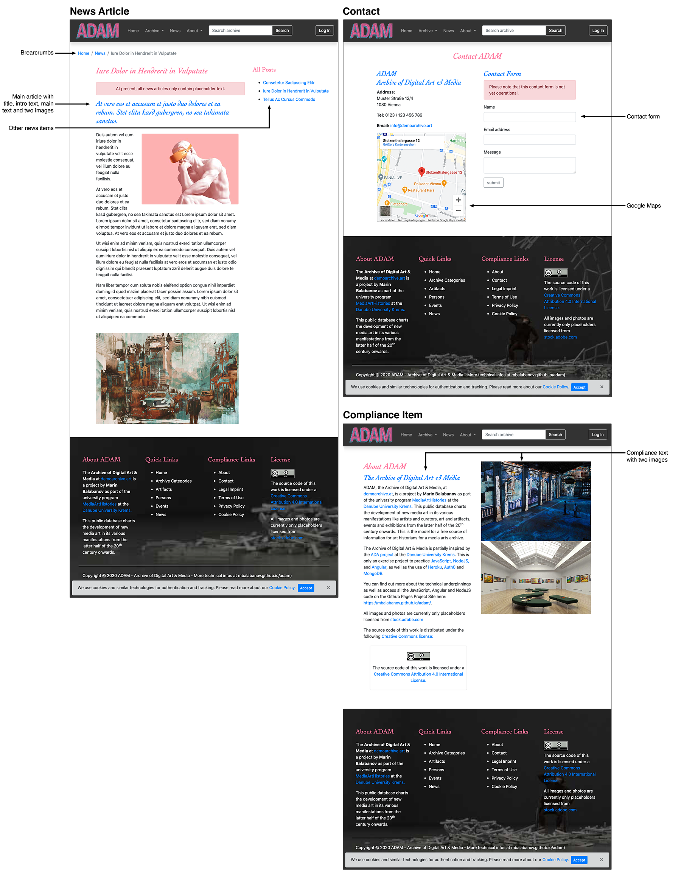

# Archive of Demo Art & Media


## Inhaltsverzeichnis
1. [Beschreibung](#1-beschreibung)
2. [Bestandteile und Installation](#2-bestandteile-und-installation)
3. [Details der unterschiedlichen Views](#3-details-der-unterschiedlichen-views)
4. [Die Struktur von ADAM](#4-die-struktur-von-adam)
5. [Konzept der Mobile App](#5-konzept-mobile-app)
6. [DB und API](#6-db-und-api)
7. [Benutzerrollen](#7-benutzerrollen)
8. [Technologien](#8-technologien)
9. [Aktualisierungen](#9-aktualisierungen)
10. [Projektplan](#10-projektplan)

## 1. Beschreibung
ADAM ist ein Projekt von Marin Balabanov als Übung für den Einsatz von Webtechnologien. In diesem **Archive of Demo Art & Media** auf [demoarchive.art](http://demoarchive.art/) können Benutzer nach digitalen Demo-Kunstwerken suchen. Auf den Detailseiten finden sie eine Beschreibung des jeweiligen Demo-Kunstwerks, sowie Fotos/Screenshots und Links zu Videos, und falls vorhanden ZIP-Dateien oder Diskimages mit den Originaldateien des Kunstwerks. Zudem finden sich Informationen über die Künstler, und bei welchen Events ihre Werke ausgestellt wurden.

Die hier besprochenen Kunstwerke gehören der [Demoszene](https://de.wikipedia.org/wiki/Demoszene) an. Unter **Demos** versteht man digitale Echtzeit-Kunst oft mit Musikuntermalung. Für die Künstler der Demoszene stellen Hardware-Einschränkungen einen Ansporn dar. Oft werden künstliche Einschränkungen vorab beschlossen, an die man sich halten muss, z.B. eine maximale Speichergröße der ausführbaren Dateien (oft nur 64Kb), oder es muss auf bestimmter Retro-Hardware mit all ihren Einschränkungen entwickelt werden (z.B. Commodore 64 oder Sinclair ZX Spectrum aus dem Jahr 1982, Atari ST oder Commodore Amiga aus dem Jahr 1985, usw.).

### 1.1 Erklärvideo über das ADAM-Projekt
In dieser Rohfassung des Erklärvideos wird der Zweck und die Funktionsweise von ADAM erklärt, sowie die kunsthistorische Bedeutung der Demo-Szene angeschnitten: [youtu.be/5qT9ATVqtbk](https://youtu.be/5qT9ATVqtbk)

### 1.2 Disclaimer
Dieses Projekt dient nur zu Übungszwecken und wurde vom "Archive of Digital Art" (ADA) der Donau Universität Krems inspiriert. Es dient als Übungsprojekt für die Anwendung zeitgemäßer Webtechnologien wie NodeJS, Angular und Heroku (in weiterer Folge kommen noch MongoDB und AWS S3 dazu).

**Die Bilder in diesem Projekt sind nur Platzhalter von [adobestock.com](http://adobestock.com). Sie sind zwar Teil dieses Repositories, sind aber nicht zur allgemeinen Verwendung freigegeben.**

### 1.3 ADAM auf demoarchive.art

ADAM besteht aus drei Teilen: Einem **API-Server** auf [adam-interface.herokuapp.com](https://adam-interface.herokuapp.com) mit Schnittstellen, um die Daten abzurufen, sowie einem Web-Frontend mit einem **öffentlichen Bereich** auf [demoarchive.art](http://demoarchive.art/), in dem Besucher die Informationen über die digitalen Demo-Kunstwerke finden, und einem **Redaktionsbereich,** in dem Redakteure neue Inhalte einpflegen und bearbeiten können, und Administratoren die Rechte verwalten können. 

[« Zurück zum Inhaltsverzeichnis](#inhaltsverzeichnis)

## 2. Bestandteile und Installation
Das Projekt besteht aus den folgenden Repositories:
- **ADAM API Server** [github.com/mbalabanov/adam](https://github.com/mbalabanov/adam) (läuft auf Heroku auf [adam-interface.herokuapp.com](http://adam-interface.herokuapp.com))
- **ADAM Web-Frontend** [github.com/mbalabanov/adam-api](https://github.com/mbalabanov/adam-api) (läuft auf Heroku  auf [adam-frontend.herokuapp.com](https://adam-frontend.herokuapp.com) mit CNAME-Eintrag auf [app.demoarchive.art](https://app.demoarchive.art))

### 2.1 Installation
Der ADAM API Server (Repository auf [github.com/mbalabanov/adam-api](https://github.com/mbalabanov/adam-api)) läuft unter NodeJS/Express. So starten Sie den Server lokal auf Port 5003:
```
cd adam-api
npm install
```
Und dann wird die API gestartet mit:
```
npm start
```

Das ADAM Web Frontend auf [github.com/mbalabanov/adam](https://github.com/mbalabanov/adam) ist eine Angular Universal SSR App (Server Side Rendering). So starten Sie die App lokal auf Port 4200:
```
cd adam
npm install
```
Durch diesen Befehl wird das Frontend gestartet:
```
ng serve
```
Eigentlich kann man eine Angular Universal app auch mit `npm run dev:ssr` lokal starten, doch leider gibt die Angular CLI derzeit noch Fehlermeldungen aus, wenn die Auth0-Integration vom Angular Universal Server angesprochen wird.

Der Grund dafür ist, dass Auth0 die DOM im Browser anspricht, aber die serverseitige App die DOM nicht kennt. Ich verwende derzeit die Domino-Bibliothek, um dem Server eine DOM vorzugaukeln, doch Auth0 erwartet eine echte DOM und gibt sporadisch Fehlermeldungen in der Angular CLI aus (funktioniert Client/Browser-seitig aber weiterhin hervorragend). Dies geschieht relativ selten im Vergleich zu den unzähligen SSR-Fehlermeldungen, die ohne Domino ausgegeben werden.

### 2.2 Frontend und API lokal ausführen
Bitte zu beachten: Wenn Sie für das Web-Frontend den lokal laufenden API Server verwenden möchten, dann findet Sie die URL der API in der Datei `src/app/apirequestservice.service.ts`.

Diese einfach auf `http://localhost:5003` ändern, dann läuft alles nur lokal. So kann man das Frontend auf `http://localhost:4200` ausführen und sämtliche Daten von der API auf `http://localhost:5003` beziehen.

[« Zurück zum Inhaltsverzeichnis](#inhaltsverzeichnis)

## 3. Details der unterschiedlichen Views

Hier ein Überblick der einzelenen Seitenansichten (Views).

### 3.1 Hauptseiten (Home, Search und Details)
Hier können Benutzer nach Werken, Künstlern und Events suchen und die Details ansehen.


### 3.2 Redaktionsbereich (Edit und Create)
Nach Anmeldung können Redakteure, Inhalte ändern und neue Einträge erstellen.


### 3.3 Information Pages (News und Compliance)
Diese Seiten dienen zur Information.


[« Zurück zum Inhaltsverzeichnis](#inhaltsverzeichnis)

## 4. Die Struktur von ADAM

ADAM ist ein Web-Frontend, das über eine API Daten von einer MongoDB bezieht und umgekehrt diese Daten über die API auch in der MongoDB aktualisiert, hinenschreibt oder löscht.


### 4.1 API-Server auf Heroku zwischen dem Web-Frontend und MongoDB mit Schnittstellen für...

- Ansehen/holen bestehender Einträge (GET)
    - `/artifacts`
    - `/artifacts/:id`
    - `/persons`
    - `/persons/:id`
    - `/events`
    - `/events/:id`
    - `/news`
    - `/featured`
    - `/featured/:id`
    - `/compliance`
    - `/compliance/:id`

- Erstellen neuer Einträge (POST)
    - `/artifacts/:id`
    - `/persons/:id`
    - `/events/:id`

- Bearbeiten bestehender Einträge (PUT)
    - `/artifacts/:id`
    - `/persons/:id`
    - `/events/:id`
    - `/news` (Es können nur alle News gleichzeitig geändert werden)
    - `/compliance` (Es können nur alle Compliance-Seiten gleichzeitig geändert werden)
    - `/featured` (Es können nur alle featured Beiträge gleichzeitig geändert werden)

- Einträge löschen (DELETE)
    - `/artifacts/:id`
    - `/persons/:id`
    - `/events/:id`

Für mehr Details zur API siehe Dokumentation weiter unten.

### 4.2 Routing-Strategien
Eine Angular-App läuft normalerweise vollkommen client-seitig (und kann Daten von einem Server beziehen). Für dieses Projekt war dieses Standardverhalten nicht geeignet. Anwender sollten in der Lage sein, die URL eines Eintrags mit anderen zu teilen. Das übliche Verhalten von Angular beruht auf der sogenannten "path location strategy". Hierbei wird die URL client-seitig gebildet, deshalb kann eine URL nicht mit anderen geteilt werden. Wenn eine geteilte URL (z.B. https://app.demoarchive.art/item/artifacts/a1 ) bei bestehender "path location strategy" von anderen Usern eingegeben werden, dann erhalten diese eine 404-Fehlermeldung, da ihre Instanz der Angular-Anwendung die URL noch nicht gebildet hat. Dieses Standardverhalten von Angular mit der "path location strategy" war somit nicht für das ADAM Web-Frontend geeignet.

Für Angular-Apps mit Website-Charakter ist die sogenannte "hash location strategy" vorgesehen. Hier wird an die Domain ein Hash-Zeichen (Raute) angehängt, bevor der Rest der Domain angehängt wird (z.B. https://app.demoarchive.art/#/item/artifacts/a1 ). Dies ermöglicht es, die URL eines Eintrages an andere zu verschicken und als Lesezeichen zu speichern. Doch auch die "hash location strategy" ist nicht für die ADAM-App geeignet. Die verwendet Auth0.com für die Authentisierung (Login und Registrierung) von Benutzern. Wenn User sich über Auth0.com eingeloggen, werden sie wieder an die ADAM-App zurückgeschickt. Auth0.com gibt einen Callback an den auth.service zurück. Doch durch die "hash location strategy" von Angular geht der Callback verloren. Ohne Anpassungen, die den Rahmen dieses Projekts bei weitem überschreiten, können Auth0.com und die "hash location strategy" nicht gemeinsam verwendet werden.

Die Lösung für die Anfoderung einer teilbaren URL ist der Einsatz von Angular Universal SSR. Hier wird zwar die "path location strategy" (das Standardverhalten) beibehalten. Allerdings wird beim ersten Aufruf der Angular-App die jeweilige Seite server-seitig zusammengestellt (gerendert). Das bedeutet, dass eine URL wie https://app.demoarchive.art/item/artifacts/a1 (also ohne "#") zuerst server-seitig gerendert wird, also durchaus geteilt werden kann. Angular Universal hat einen weiteren Vorteile, den "herkömmliche" Websites immer schon hatten, die Site kann von Suchmaschinen gecrawlt und indiziert werden.

Allerdings gibt es hier einen Wermutstropfen. Da einzelen Seiten/Views der App server-seitig gerendert werden, darf die DOM nicht ohne User-Interaktion angesprochen werden, weil der Server keine DOM kennt. Das wiederum führt zu kleinen, aber nicht kritischen Konflikten mit Auth0.com, das seinerseits die DOM anspricht. Diese Konflikte sind keine KO-Kriterien, weil sie sich nur als serverseitige Fehlermeldungen  äußern, ohne die Funktionsweise zu beeinträchtigen. Wenn die Authentisierung vom Anwender aufgerufen wird, dann verhält sich die App wie vorgesehen. Da die ständigen server-seitigen Fehlermeldungen während der lokalen Entwicklung störend sind, wird davon abgeraten `npm run dev:ssr` zum Starten der App zu verwenden und stattdessen auf das bewährte `ng serve` zurückzugreifen. Trotzdem wird empfohlen, sicherheitshalber gelegentlich auch mit `npm run dev:ssr` zu testen.

Doch auch für die fehlende DOM auf Seite des Servers, sieht Angular Universal ein Workaround vor. Mit dem Domino-Modul kann der App auf dem Server eine DOM "vorgegaukelt" werden. Dieses Modul kommt bei ADAM zum Einsatz. Dadurch werden die Angular Universal-Fehlermeldungen komplett vermieden... allerdings kommen nun Fehlermeldungen vom auth.service, der die Auth0.com-Authentisierung anspricht, weil dieses Service mit einer vorgegaukelten DOM nichts anfangen kann und eine echte, ehrliche DOM erwartet. Diese server-seitigen Fehlermeldungen sind allerdings viel seltener, und auch hier beeinträchtigen sie die Funktionsweise der App überhaupt nicht.

Soweit zum Exkurs über den Aufwand, der notwendig war, um dieser Angular App ein Verhalten zu verpassen, das für die allermeisten anderen Websites selbstverständlich ist.

### 4.3 Öffentlicher Bereich im Web-Frontend und fünf Arten von Ansichten:

Das Web-Frontend wurde mit Angular entwickelt. Es läuft als Angular Universal SSR App auf Heroku.


4.3.1 **Startseite** mit Karussell für Einträge, die von Admins als "besonders interessant" markierte wurden, sowie ein Grid mit acht der chronologisch zuletzt publizierten Einträge, allgemeine Informationen über die Plattform, Suchfunktion und eine Kategorienauswahl, die beide auf die Suchergebnisseite mit Filtermöglichkeiten führt.

4.3.2 **Suchergebnisseite** auf der die Suchergebnisse gefiltert werden können.

4.3.3 **Detailseite,** die für die Detailansicht eines Artefakts, eines Künstlers und eines Events verwendet wird. Das Layout besteht aus einer Beschreibung, eines Fotobereichs, eines Bereichs für ein eingebettetes Video und darunter einer Liste an verwandten Einträgen:
    a. Bei einer _Künstler-Detailseite_ eine Liste der Arbeiten des Künstlers.
    b. Bei einer _Artefakt-Detailseite_ eine Liste der Künstler, die das Kunstwerk erschaffen haben
    C. Bei einer _Detailseite über ein Event_ eine Liste der ausgestellten Werke.

4.3.4 **Informationsseite,** in der allgemeine Informationen zu einem Thema stehen mit Text und Bildern, z.B. Artikel über Neuigkeiten, aber auch Nutzungsbedingungen und Datenschutzerklärung

4.3.5 Seite für den **Login bzw. die Registrierung** über den auth0.com Service

4.3.6 **News-Seiten** mit dynamischem Inhalt. Diese beziehen ihren Inhalt über die API (/news und /news:id).

4.3.7 Diverse **Info-Seiten** über die allgemeine Bedienung des Kunstarchivs (z.B. "About", "Privacy Policy" und andere Complaince-Seiten). Diese beziehen ihren Inhalt ebenfalls über die API (/compliance).

4.3.8 Die **Kontaktseite** ist statisch und hat ein Kontaktformular.

### 4.4 Umgesetzte Struktur
Die folgende Struktur wurde auch tatächlich umgesetzt (hier mit einer Auflistung sämtlicher Components, die auf den Einzelseiten verwendet werden). Dieses Diagram entstand mit [MonoDraw](https://monodraw.helftone.com).

````
    +-+-+-+-+ +-+-+-+-+-+-+-+-+ +-+-+-+-+-+-+-+-+-+
    |A|D|A|M| |F|R|O|N|T|E|N|D| |S|T|R|U|C|T|U|R|E|
    +-+-+-+-+ +-+-+-+-+-+-+-+-+ +-+-+-+-+-+-+-+-+-+


   ┌──────────┐ PAGE STRUCTURE
   │   Home   │ 1. navbar.component with search and login (uses auth.service for
 ┌─┤   Page   │ login, sends search queries to search page).
 │ │          │ 2. carousel.component showing featured items (uses
 │ └──────────┘ apirequests.service to GET featured items).
 │              3. Static information on purpose of archive.
 │              4. archivecategories.component with search and links to the three
 │              categories (uses apirequests.service to GET category infos).
 │              5. Static information on how to contribute.
 │              6. newslist.component showing current news stories (uses
 │              apirequests.service to GET news items).
 │              7. footer.component.
 │              8. cookiewarning.component.
 │
 ├───────┬────────────────────────────────────────────────┐
 │       │                                                │
 │       ▼                                                ▼
 │ ┌──────────┐ PAGE STRUCTURE                       ┌──────────┐
 │ │ Archive  │ 1. navbar.component with search      │  Search  │
 │ │   Page   │ and login (uses auth.service         │ Results  │
 │ │          │ for login, sends search queries      │   Page   │
 │ └─────┬────┘ to search page).                     └────┬─────┘
 │       │      2. archivecategories.component            │
 │       │      (uses apirequests.service to              │ PAGE STRUCTURE
 │       │      GET category infos)                       │ 1. navbar.component with
 │       │      3. footer.component.                      │ search and login (uses
 │       │      4. cookiewarning.component.               │ auth.service for login,
 │       ▼                                                │ sends search queries to
 │      ┌──────────┐ PAGE STRUCTURE                       │ search page).
 │      │ Category │ 1. navbar.component with search      │ 2. searchall.component with
 │      │   List   │ and login (uses auth.service for     │ a searchfilter and
 │      │   page   │ login, sends search queries to       │ pagination for the results
 │      └─────┬────┘ search page).                        │ (uses apirequests.component
 │            │      2. categorylist.component (uses      │ to GET category items).
 │            │      apirequests.service to GET this      │ 3. footer.component.
 │            │      category's infos).                   │ 4. cookiewarning.component.
 │            │      3. footer.component.                 │
 │            │      4. cookiewarning.component.          │
 │            │    ┌──────────────────────────────────────┘
 │            │    │
 │            ▼    ▼
 │           ┌──────────┐ PAGE STRUCTURE
 │           │   Item   │ 1. navbar.component with search and login
 │           │ Details  │ (uses auth.service for login, sends
 │           │   Page   │ search queries to search page).
 │           └──────────┘ 2. itemdetails.component (uses
 │                        apirequests.service to GET item details
 │                        and auth.service to allow
 │                        editing/deleting the item).
 │                        3. footer.component.
 │                        4. cookiewarning.component.
 │
 ├───────┬────────────────────────────────────────────────┐
 │       │                                                │
 │       ▼                                                ▼
 │ ┌──────────┐ PAGE STRUCTURE                       ┌──────────┐ PAGE STRUCTURE
 │ │   Edit   │ 1. navbar.component with search and  │   User   │ 1. navbar.component with search
 │ │  Items   │ login (uses auth.service for login,  │ Profile  │ and login (uses auth.service
 │ │   Page   │ sends search queries to search page).│   Page   │ for login, sends search queries
 │ └──────────┘ 2. createarchiveitem.component (uses └──────────┘ to search page).
 │              apirequests.service to PUT new                    2. authprofile.component (uses
 │              items).                                           auth.service for user profile
 │              3. editcarouselfeatures.component                 data).
 │              (uses apirequests.service to GET and              3. footer.component.
 │              PUT featured items).                              4. cookiewarning.component.
 │              4. editnewspages.component (uses
 │              apirequests.service to GET and PUT
 │              news).
 │              5. editcompliancepages.component
 │              (uses apirequests.service to GET and
 │              PUT compliance pages).
 │              6. footer.component.
 │              7. cookiewarning.component.
 │
 └───────┬────────────────────────────────────────────────┐
         │                                                │
         ▼                                                ▼
   ┌──────────┐ PAGE STRUCTURE                       ┌──────────┐ PAGE STRUCTURE
   │News List │ 1. navbar.component with search      │Compliance│ 1. navbar.component with search and
   │   Page   │ and login (uses auth.service         │   Page   │ login (uses auth.service for login,
   │          │ for login, sends search queries      │          │ sends search queries to search page).
   └─────┬────┘ to search page).                     └────┬─────┘ 2. compliancearticle.component to
         │      2. newslist.component (uses               │       show the text of the current
         │      apirequests.service to GET news           │       compliance page based on URL slug
         │      items).                                   │       (uses apirequests.service to GET the
         │      3. footer.component.                      │       compliance text).
         │                                                │       3. footer.component.
         │                                                │       4. cookiewarning.component.
         ▼                                                ▼
        ┌──────────┐ PAGE STRUCTURE                      ┌──────────┐ PAGE STRUCTURE
        │   News   │ 1. navbar.component with search     │ Contact  │ 1. navbar.component with search
        │ Article  │ and login (uses auth.service        │   Page   │ and login (uses auth.service
        │   Page   │ for login, sends search queries     │          │ for login, sends search queries
        └──────────┘ to search page).                    └──────────┘ to search page).
                     2. newsarticle.component to                      2. Static information with
                     show the text of the current                     infos and contact form.
                     news item based on URL slug                      3. footer.component.
                     (uses apirequests.service to                     4. cookiewarning.component.
                     GET the news item).
                     3. footer.component.
                     4. cookiewarning.component.

````

### 4.5 Wireframes Besucheransicht
Untenstehend finden Sie die ursprünglichen Wireframes des öffentlichen Bereichs, den Benutzer besuchen können, ohne vorher einloggen zu müssen.


### 4.6 Nicht-öffentlicher Bereich im selben Web-Frontend mit...

**4.6.1 Redaktionsansicht** in der Benutzer mit Editor-Rechten bestehende Einträge bearbeiten können (Edit-Funktion wird nur nach dem Einloggen sichtbar) sowie neue Einträge erstellen können (Funktion für einen neuen Eintrag ist auch erst nach dem Einloggen sichtbar). Dieser Bereich befindet sich im Angular Webfrontend.

**4.6.2 Admin-Bereich,** um Benutzer zu verwalten (deaktivieren und reaktivieren). Dieser Bereich befindet sich in Auth0.com


### 4.7 Wireframes Redaktionsansicht
Untenstehend finden Sie die ursprünglichen Wireframes des Redaktionsbereichs, der nur für Benutzer zugänglich ist, die sich vorher eingeloggt haben.


[« Zurück zum Inhaltsverzeichnis](#inhaltsverzeichnis)

## 5. Konzept der Mobile App

Falls noch Entwicklungszeit übrigbleibt wird noch Optional eine Mobile App entwickelt mit folgenden Features. 

a. Ansicht aller in der Mobile App vorbereiteter Einträge
    
b. Neuen Eintrag auf dem mobilen Gerät erstellen für Artefakt, Künstler, Künstlerkollektiv, Sammlung, Ausstellung.
    
c. Fotos und Videos auswählen
    
d. Einloggen
    
e. Eintrag mit Fotos und Video URLs hochladen

### 5.1 Mobile App Wireframes


[« Zurück zum Inhaltsverzeichnis](#inhaltsverzeichnis)


## 6. DB und API

Als Datenbank wird MongoDB verwendet, das ein Dokument-basiertes Datenmodell hat mit der Möglichkeit Schema-los zu arbeiten.

- **Artifacts, Persons, Events:** id (String), category (String), name (String), aliases (Array), shortdescription (String), longdescription (String), dates (Array aus label, date), tags (Array), images (Array aus id, url, name, description), videos (Array aus id, url, name, description), websiteURLs (Array aus id, url, name), assets (Array aus id, url, name), artifacts (Array), persons (Array), events (Array)
- **News:** id (String), title (String), image (String), largeimage (String), shortdescription (String), articletext (String)
- **Featured:** id (String), image (String), title (String), description (String), link (String)
- **Compliance:** id (String), category (String), title (String), firstimage (String), secondimage (String), articletext (String)

### 6.1 Datenmodell


### 6.2 API-Dokumentation

Die API ist verfügbar unter [adam-interface.herokuapp.com](https://adam-interface.herokuapp.com)
*Wenn Sie die URL ohne Parameter aufrufen, wird eine Anleitung zurückgeliefert.*

#### GET (Root):
- `/` Anleitung

#### GET (mit all als Parameter):
- `/all` Alle Daten

#### GET (OHNE einer ID):
- `/artifacts` Alle artifacts (Kunstwerke).
- `/persons` Alle persons (Künstler, Kuratoren).
- `/events` Alle Events (Ausstellungen, Vernisagen, Performances).
- `/news` Die News-Artikel und ihre Inhalte.
- `/compliance` Die Texte der Compliance Seiten.
- `/featured` Die vier auf der Startseite ausgewiesenen Einträge.

#### GET (MIT einer ID):
- `/artifacts/id` Ein einzelnes Artifact (Kunstwerk).
- `/persons/id` Eine einzelne Person (Künstler, Kuratoren).
- `/events/id` Ein einzelner Event (Ausstellung, Vernisage, Performance).
- `/news/id` Ein einzelner News-Artikel und seine Inhalte.
- `/compliance/id` Der Inhalt einer einzelnen Compliance-Seite.
- `/featured/id` Einen der vier auf der Startseite ausgewiesenen Beiträge.

#### DELETE (MIT einer ID):
- `/artifacts/id` Ein einzelnes Artifact (Kunstwerk) löschen.
- `/persons/id` Eine einzelne Person (Künstler, Kuratoren) löschen.
- `/events/id` Einen einzelnen Event (Ausstellung, Vernisage, Performance) löschen.

#### PUT (MIT einer ID):
- `/artifacts/id` Ein einzelnes Artifact (Kunstwerk) bearbeiten.
- `/persons/id` Eine einzelne Person (Künstler, Kuratoren) bearbeiten.
- `/events/id` Einen einzelnen Event (Ausstellung, Vernisage, Performance) bearbeiten.
- `/news` Den Inhalt sämtlicher News-Artikel ändern.
- `/compliance` Den Inhalt aller Compliance-Seiten ändern.
- `/featured` Alle Featured-Items ändern.

#### POST (MIT der Parameter new):
- `/artifacts/new` Ein neues Artifact (Kunstwerk) erstellen.
- `/persons/new` Eine neue Person (Künstler, Kuratoren) erstellen.
- `/events/new` Einen neuen Event (Ausstellung, Vernisage, Performance) erstellen.

### 6.3 JSON-Beispiel (Artifact)

```
{
    "_id": "a0123456",
    "category": "artifacts",
    "name": "Varoph Lorem Ipsum",
    "aliases": ["Lemon Dance", "Folklore Elephant"],
    "shortdescription": "Varoph Lorem ipsum dolor sit amet, test consetetur sadipscing elitr, sed diam nonumy eirmod tempor invidunt ut labore et dolore magna aliquyam erat, sed diam voluptua.",
    "longdescription": "<p>Varoph Lorem ipsum dolor sit amet, test consetetur sadipscing elitr, sed diam nonumy eirmod tempor invidunt ut labore et dolore magna aliquyam erat, sed diam voluptua.</p><p>At vero eos et accusam et justo duo dolores et ea rebum.</p><p>Lorem ipsum dolor sit amet, consectetur adipiscing elit. Fusce dapibus, tellus ac cursus commodo, tortor mauris condimentum nibh, ut fermentum massa justo sit amet risus. Sed posuere consectetur est at lobortis. Vestibulum id ligula porta felis euismod semper.</p>",
    "dates": [{"label": "First released on ", "date": "1987-03-01"}],
    "tags": [
        "Pharetra Tortor",
        "Commodo",
        "Generative",
        "Gustatory",
        "Hypermediacy"
    ],
    "images": [
        {
            "url": "assets/img/artifacts/artifacts1.jpg",
            "name": "Venenatis Cursus Nullam",
            "description": "Cras justo odio, dapibus ac facilisis in, egestas eget quam."
        },
        {
            "url": "assets/img/collections/collections1.jpg",
            "name": "Sed diam nonumy eirmod tempor",
            "description": "Labore et dolore magna aliquyam erat, sed diam voluptua."
        },
        {
            "url": "assets/img/portraits/portrait07.jpg",
            "name": "Cras Ligula Consectetur Tortor",
            "description": "Vivamus sagittis lacus vel augue laoreet rutrum faucibus dolor auctor. Curabitur blandit tempus porttitor."
        },
        {
            "url": "assets/img/additional/additional-01.jpg",
            "name": "Sollicitudin Inceptos Parturient",
            "description": "Nulla vitae elit libero, a pharetra augue."
        }
    ],
    "videos": [
        {
            "url": "https://youtu.be/sUx-f686Wg4",
            "name": "Consetetur sadipscing Sit Lorem",
            "description": "Consetetur sadipscing elitr, sed diam nonumy eirmod tempor."
        },
        {
            "url": "https://www.youtube.com/watch?v=w54uNAuqE1Y",
            "name": "Consetetur sadipscing",
            "description": "Consetetur sadipscing elitr, sed diam nonumy eirmod tempor."
        },
        {
            "url": "https://youtu.be/oarR61SeY8E",
            "name": "Elit Justo Pellentesque",
            "description": "Cras mattis consectetur purus sit amet fermentum."
        }
    ],
    "websiteURLs": [
        {
            "name": "Medien Art Net",
            "url": "http://www.medienkunstnetz.de/mediaartnet/"
        }
    ],
    "assets": [
        {
            "name": "Native executable",
            "url": "http://pacidemo.planet-d.net/archives/POV003.ZIP"
        }
	"artifacts" : [
		{
			"related_id" : ObjectId("5f5295737f3fe44a067daea3"),
			"name" : "Praesent Luptatum Bustdraugh"
		},
		{
			"related_id" : ObjectId("5f5295737f3fe44a067daea4"),
			"name" : "Tempor Soluta"
		},
		{
			"related_id" : ObjectId("5f5295737f3fe44a067daea5"),
			"name" : "Stet Clita Kasd"
		}
	],
	"persons" : [
		{
			"related_id" : ObjectId("5f5296337f3fe44a067daeac"),
			"name" : "Name Liber"
		}
	],
	"events" : [
		{
			"related_id" : ObjectId("5f5296eb7f3fe44a067daead"),
			"name" : "Accusam et Justo"
		},
		{
			"related_id" : ObjectId("5f5296eb7f3fe44a067daeb0"),
			"name" : "Vero Eos Wornbrake"
		}
	]
}
```

[« Zurück zum Inhaltsverzeichnis](#inhaltsverzeichnis)

## 7. Benutzerrollen

1. **Editor:** Kann Einträge erstellen und bearbeiten
2. **Admin:** Kann Benutzer deaktivieren, reaktivieren und ihre Rolle ändern

[« Zurück zum Inhaltsverzeichnis](#inhaltsverzeichnis)

## 8. Technologien

**Webfrontend:**
- Angular Universal (Funktionalität)
- Bootstrap (Design)
- jQuery (Allgemein)

**Registrierung und Usermanagement:**
- auth0.com (Login, Registrierung, Benutzerprofil)

**API Server:**
- Node JS
- Express
- MongoDB
- Heroku (Hosting)
- Amazon S3 (Bilder Hosting)

**Mobile App:**
- Node JS
- Angular
- Cordova oder NativeScript

[« Zurück zum Inhaltsverzeichnis](#inhaltsverzeichnis)

## 9. Aktualisierungen
- **16. September 2020:** Datenbank läuft jetzt auf MongoDB Atlas unter mongodb+srv://<username>:<password>@cluster0.xuhkf.mongodb.net/<dbname>. Daten des Web-Frontends werden  über die API vom MongoDB-Cluster bezogen (GET und POST, aber PUT noch nicht).
- **8. September 2020:** Collections angepasst an die Erfordernisse von MongoDB, Source Code teilweise dokumentiert, Rohfassung von Erklärvideo [youtu.be/pwi1-JSts-Q](https://youtu.be/pwi1-JSts-Q) fertiggestellt.
- **1. September 2020:** Existierende Archiveinträge können nun bearbeitet werden und die Eingabeformulare werden nun auf Vollständigkeit validiert. Der integrierte TinyMCE und ein Datepicker machen die Contenteingabe komfortabler.
- **27. August 2020:** Im Redaktionsbereich kann man jetzt neue Archiveinträge anlegen, sowie News-Artikel, Compliance-Seiten und featured Items ändern. Allerdings kann man noch nicht die bestehenden Archiveinträge ändern und die Eingabeformulare werden auch noch nicht validiert.
- **22. August 2020:** App komplett aufgeräumt und auf Angular Unversal konvertiert ( läuft auf  [adam-frontend.herokuapp.com](https://adam-frontend.herokuapp.com) mit CNAME-Eintrag auf [app.demoarchive.art](https://app.demoarchive.art) )
- **20. August 2020:** API vom Frontend getrennt. Hat nun ein eigenes Repository auf [github.com/mbalabanov/adam-api](https://github.com/mbalabanov/adam-api)
- **13. August 2020:** Auth0-Integration abgeschlossen (vorläufig mit Anmeldung über Email und Google-Account).
- **12. August 2020:** Öffentliches Web-Frontend ist soweit fertig und alle Consolen-Fehler sind beseitigt. Die gesamte Suchfunktion läuft über Angular Search-Filter (und nicht über LunrJS). Die ersten Schritte für das Redaktions-Backend sind mit der vorläufig unvollständigen Integration von auth0.com gemacht.
- **7. August 2020:** Öffentliches Web-Frontend bezieht nun sämtliche Daten von der API (allerdings treten noch Fehler in der Console auf und einige Routes funktionieren noch nicht richtig).
- **6. August 2020:** Erweitertes Angular-Frontend, konsolodiertes Datenmodell und angepasste API.
- **31. Juli 2020:** Erste Fassung des Web-Frontends auf [demoarchive.art](http://demoarchive.art/) fertiggestellt (allerdings noch ohne API-Anbindung).
- **30. Juli 2020:** Erste Fassung der API auf [adam-interface.herokuapp.com](https://adam-interface.herokuapp.com) fertiggestellt.
- **24. Juli 2020:** Erster unvollständiger Versuch, mit der API und dem Webfrontend (noch ohne Angular) zu Versuchszwecken.
- **15. Juli 2020:** Mobile App Wireframes hinzugefügt, API aktualisiert, GET-API-Aufrufe bereit, Domain demoarchive.art registriert.
- **13. Juli 2020:** Datenmodelldiagramm, Sitemap und Wireframes aktualisiert
- **12. Juli 2020:** Testdaten als JSON-Datei
- **8. Juli 2020:** Erstfassung der Dokumentation 

[« Zurück zum Inhaltsverzeichnis](#inhaltsverzeichnis)

## 10. Projektplan


- **Bis 16. Juli 2020:** Konzept, Wireframes, Datenmodell, detaillierter Ablaufplan und Projektplan. API-Server mit Musterdatensätzen auf Heroku. API-Aufrufe funktionieren und liefern Daten zurück.

- **Bis 24. Juli 2020:** Funktionierendes und implementiertes Design des Webfrontends in Angular.

- **Bis 31. Juli 2020:** Öffentlicher Teil des Web-Frontends fertiggestellt. Frontend zeigt die vier unterschiedlichen Ansichten, kann über die API Musterdaten abrufen und anzeigen.

- **Bis 28. August 2020:** Redaktionsbereich und Admin-Bereich (nicht-öffentlicher Bereich des Webfrontends) mit Login, Registrierung, neue Einträge erstellen, Einträge bearbeiten, Einträge deaktivieren und reaktivieren, Benutzer deaktivieren und reaktivieren.

- **Bis 4. September 2020:** Redaktionsbereich und Admin-Bereich. Erste Daten auf MongoDB.

- **Bis 11. September 2020:** Umstellung der API, MongoDB anzusprechen.

- **Bis 18. September 2020:** Bugfixes und Erweiterungen.

- **Bis 25. September 2020:** Bugfixes und Erweiterungen.

[« Zurück zum Inhaltsverzeichnis](#inhaltsverzeichnis)
